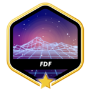

<section align="center">
  
</section>

<section>

  ### whoami
  
Software developer. I build things close to the metal and far from the ordinary. When not coding... climbing walls (literally :D).

</section>

<section>

  ### Stacks

  `main tecnologies`

    
    
    
    
    

  `web`

  
  
  
  
  

  `api`

  
  

  `database`

  
  

  `enviroment`

    

  <!-- 
denionline@github:~$ cat stats.txt

  

    
     
    
  
 -->
</section>

<!-- <section>
  
denionline@github:~$ echo $STATUS

  
always building something.

</section> -->

<section>

  ### Links

  
  <!--  -->
</section>

<section>

  

  ### 42 Projects
  

  

  

    <h2 style="font-size: 1rem;text-align: left">Milestone 0</h2>
    
  

  

    <h2 style="font-size: 1rem;text-align: left">Milestone 1</h2>
    
    
    
  

  

    <h2 style="font-size: 1rem;text-align: left">Milestone 2</h2>
    
    
    
  

  

    <h2 style="font-size: 1rem;text-align: left">Milestone 3</h2>
    
    
  

  

    <h2 style="font-size: 1rem;text-align: left">Milestone 4</h2>
    
    
    
  

  

</section>

<section>
  
denionline@github:~$ ./gitpacman

  <picture>
    <source media="(prefers-color-scheme: dark)" srcset="https://raw.githubusercontent.com/denionline/denionline/output/pacman-contribution-graph-dark.svg">
    <source media="(prefers-color-scheme: light)" srcset="https://raw.githubusercontent.com/denionline/denionline/output/pacman-contribution-graph.svg">
    
  </picture>
</section>